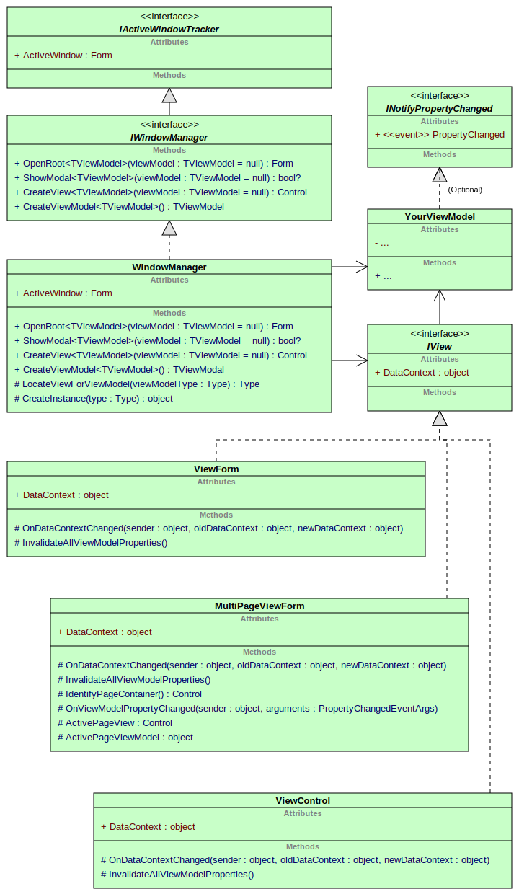

Nuclex.Windows.Forms  
====================

This is a lightweight MVVM framework for Windows Forms. It is based on
the "convention over configuration" idea and requires zero configuration.
Rather than set up view mappings and view model services, you can simply
ask it to display a view model (`ExampleViewModel`) with its default view
and it will figure out what the correct view is by name (i.e. `ExampleForm`).

There are unit tests for the whole library, so everything is verifiably
working on all platforms tested (Linux, Windows, Raspberry).


MVVM
----

MVVM stands for Model-View-ViewModel. It is a way to design GUI applications
that improves testability and keeps the UI separate from the business logic.

- The Model is the underlying data the application is working with,
  not designed in any way to facilitate any GUI display or editing

- The ViewModel is like an adapter - it presents the data in the model in
  a way that can be easily dealt with by the view. For example, sets of
  items may be exposed as `BindingList<Item>`.

- The View is the UI itself - for example, the main window or a modal dialog
  that is displayed would be a view, too. Each view has a connected ViewModel
  and the only code in the view class should be what directly handles the UI,
  like updating button states when the ViewModel signals a change.


Basic Design
------------

This library implements the MVVM pattern through its `WindowManager` class:



The `WindowManager` keeps track of all open windows and their view models,
so your basic `Main()` method, which normally looks like this:

```csharp
[STAThread]
static void Main() {
  Application.EnableVisualStyles();
  Application.SetCompatibleTextRenderingDefault(false);
  Application.Run(new MainForm());
}
```

Now becomes this:

```csharp
[STAThread]
static void Main() {
  Application.EnableVisualStyles();
  Application.SetCompatibleTextRenderingDefault(false);

  var windowManager = new WindowManager();
  Application.Run(windowManager.OpenRoot<MainViewModel>());
}
```

As you can see, we no longer mention the `MainForm` by name, instead we ask
the `WindowManager` to construct a new `MainViewModel` and also create a view
that displays it.

It does so by using a "convention over configuration" approach, meaning it
assumes that if you request a view for `FlurgleSettingsViewModel`, it will
look for a view named `FlurgleSettingsView`, `FlurgleSettingsForm`,
`FlurgeSettingsWindow` or `FlurgleSettingsDialog` class and try to construct
an instance of that class.

Furthermore, if that class implements the `IView` interface, the view model
will be assigned to its `DataContext` property, establishing
the View/ViewModel relationship.


Adding an IoC Container
-----------------------

In the previous example, the view and its view model were constructed using
`Activator.CreateInstance()` - a method provided by .NET that creates a new
instance via a type's default constructor.

Most of the time, ViewModels have constructor parameters, however. For example
to provide the ViewModel with the data it is supposed to be an adapter for.
You can achieve that by constructing the ViewModel yourself and passing it
to the `WindowManager.OpenRoot()` or `WindowManager.ShowModal()` methods.

A much better approach is to use a dependency injector - an IoC container with
automatic constructor parameter injection. My favorite one is Ninject (due to
its neat setup with a fluent interface), but you can use any container you
wish, simply by inheriting your own `WindowManager` class:

```csharp
public class NinjectWindowManager : WindowManager {

  public NinjectWindowManager(IKernel kernel, IAutoBinder autoBinder = null) :
    base(autoBinder) {
    this.kernel = kernel;
  }

  protected override object CreateInstance(Type type) {
    return this.kernel.Get(type);
  }

  private IKernel kernel;
}
```

Your `NinjectWindowManager` will now use `IKernel.Get()` to construct its
ViewModels, allowing their constructors to require any services and instances
you have set up in your Ninject kernel.

```csharp
class MainViewModel {

  public MainViewModel(IMyService myService, IMySettings mySettings) {
    // ...
  }

}
```
